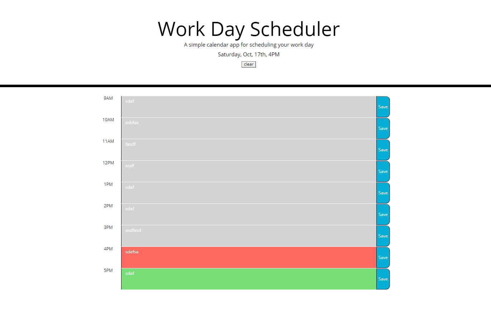

# 05-Third-Party-APIs-Work-Day-Scheduler

# Created by Santiago Hincapie 

# Updated on 10/17/2020

# Link to web site

https://santiagohr2020.github.io/Third-Party-APIs-Work-Day-Scheduler/

# Layout

The day scheduler covers a working day from 9AM to 5PM

# Techonogies used

HTML5, CSS, Bootstrap, JavaScript, JQuary, and moment.js

# Site Images

# Screenshot of the start page

